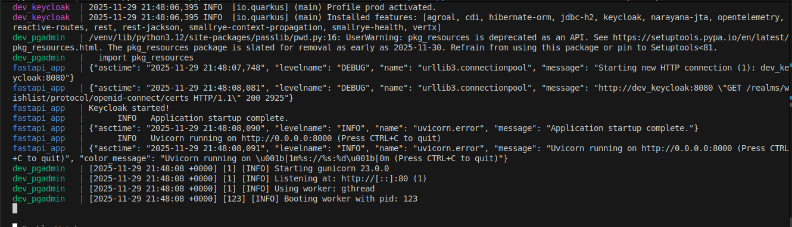
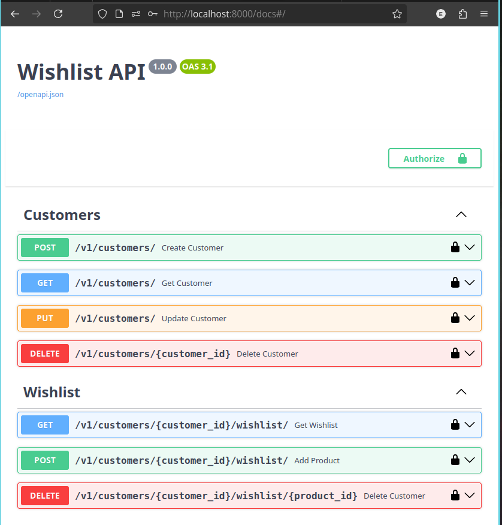
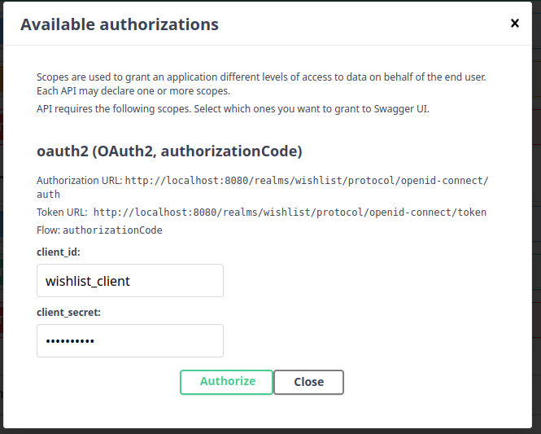
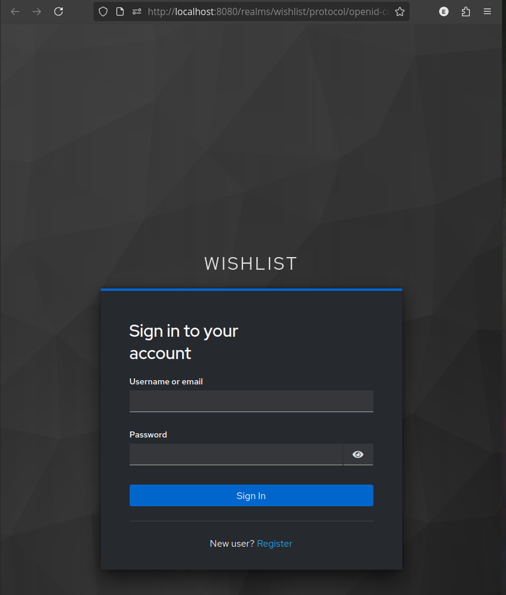
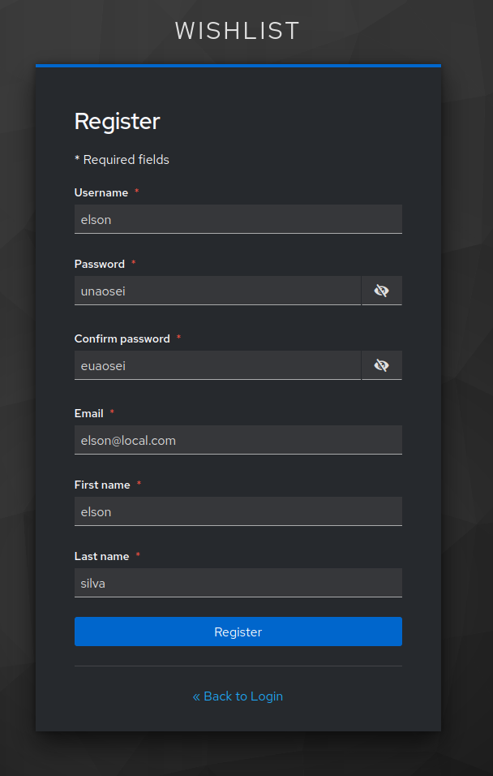
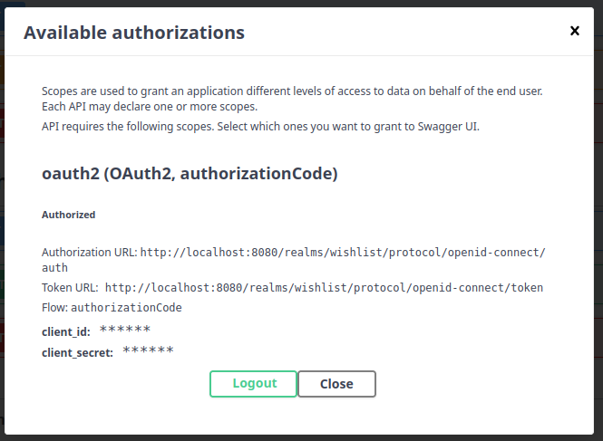
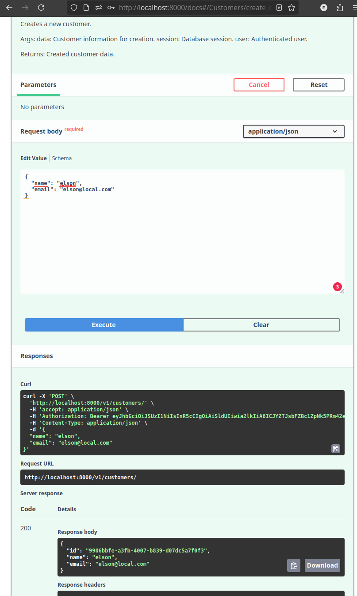

# Wishlist API

Este projeto implementa uma API REST de Wishlist para clientes, seguindo o cenário proposto no desafio técnico do LuizaLabs.

A API permite criar, atualizar, visualizar e remover Clientes e gerenciar a lista de produtos favoritos (wishlist) de cada cliente.
O foco principal é performance, consistência, cache e segurança.

### Tecnologias Utilizadas

- FastAPI — Framework principal da API

- PostgreSQL — Banco de dados relacional

- SQLAlchemy (async) — ORM para acesso assíncrono

- Alembic — Versionamento de banco

- Redis — Cache de produtos

- PyJWT — Manipulação de tokens

- Keycloak — Autenticação e autorização         

- Poetry — Gerenciamento de dependências

- Docker + Docker Compose — Infraestrutura e execução

### Cenário do Desafio

O Magalu está expandindo seus serviços e precisa de uma nova API responsável por gerenciar Clientes e seus Produtos Favoritos.
Essa API será consumida por diversos dispositivos e sofrerá alto volume de requisições, exigindo:

- Alto desempenho

- Cache eficiente

- Dados consistentes

- Autenticação e ACL seguras

- Arquitetura modular e escalável

### Recursos Implementados
**Clientes**

- Criar cliente (POST /v1/customers/)

- Listar todos os clientes (GET /v1/customers/)

- Atualizar dados do cliente (PUT /v1/customers/)

- Remover (soft delete) cliente (DELETE /v1/customers/{customer_id})

- Validação: e-mails são únicos

- Campos: nome, email

**Wishlist**

- Listar wishlist de um cliente

- Adicionar produto à wishlist

- Remover produto da wishlist

- Cada cliente possui apenas uma wishlist

- Não permite produtos duplicados

- Não permite adicionar produtos inexistentes

**Integração com API de Produtos (externa)**

- As respostas da API externa são cacheadas no Redis:

 - TTL curto: 5 minutos

 - TTL longo: 24 horas

 - TTL longo é utilizado quando a API de produtos está fora do ar

Se ambos os caches falharem, o produto é marcado como not_found


### Endpoints da API

**Clientes**

- POST   /v1/customers/

- GET    /v1/customers/

- PUT    /v1/customers/

- DELETE /v1/customers/{customer_id}

**Wishlist**
- GET    /v1/customers/{customer_id}/wishlist/

- POST   /v1/customers/{customer_id}/wishlist/

- DELETE /v1/customers/{customer_id}/wishlist/{product_id}

### Perfomance e Cache

As requisições de produto (via ProductService) são otimizadas com multilayered caching:
| Origem       | Quando é usada                              |
|--------------|----------------------------------------------|
| cache_short  | Produto encontrado no cache de 5 min         |
| cache_long   | API externa caiu → cache de 24h é usado      |
| api          | API externa respondeu normalmente            |
| not_found    | Produto não existe em nenhuma camada         |

O retorno do endpoint inclui estatísticas:

```json
{
  "items": [...],
  "source": {
    "from_cache_short": [],
    "from_cache_long": [],
    "from_api": [],
    "not_found": []
  }
}
```

### Segurança (Keycloak) 

 - Autenticação baseada em Bearer Token

 - Clientes com role CUSTOMER só podem acessar a própria wishlist

 - Administradores podem acessar qualquer cliente

### Execução com Docker
**Subir todos os serviços**

```bash
docker compose up --build
```

Isso sobe:

- Backend FastAPI | Scripts de migração Alembic

- Banco PostgreSQL

- Redis

- Keycloak


### Migrações do Banco (Alembic)

Criar nova migration:

```bash
alembic revision --autogenerate -m "initial"
```

Aplicar no banco:

```bash
alembic upgrade head
```

Executar localmente (sem Docker)

```bash
poetry install
poetry run fastapi run app/main.py
```


### Estrutura do Projeto
```bash
app/
 ├── api/
 ├── core/
 ├── models/
 ├── services/
 ├── schemas/
 ├── main.py
 └── ...
docker-compose.yml
Dockerfile
README.md
```

Procurei incorporar o máximo de boas práticas e conhecimentos para implementar uma API robusta e escalável. Infelizmente, o tempo disponável foi limitado e não foi possível incluir ferramentas de observabilidade, circuit breaker, entre outros recursos adicionais.


## Passo a passo para executar

*Pré-requisito*: Docker e Docker Compose instalados.

Antes de tudo renomeie o arquivo Docker/.env.example para Docker/.env

1 - Para executar localize o diretório Docker onde está o arquivo `docker-compose.yml`.

2 - Suba os serviços

```bash
docker compose up --build
```

3 - aguarde todos os seriços inicializar: 

<div align="center">
  <picture>
    <source media="(prefers-color-scheme: dark)" srcset="docs/start_1.png">
    <source media="(prefers-color-scheme: light)" srcset="docs/start_1.png">
    
  </picture>

</div>

Verifique os logs e aguarde a linha: 
```bash
INFO   Application startup complete.
```

4 - Acesse a documentação (Swagger UI) 

Abra no navegador: http://localhost:8000/docs#/

<div align="center">
  <picture>
    <source media="(prefers-color-scheme: dark)" srcset="docs/wishlist_api.png">
    <source media="(prefers-color-scheme: light)" srcset="docs/wishlist_api.png">
    
  </picture>

</div>

5 - Autenticação (necessária antes de testar as rotas)

 - Clique em Authorize (canto superior direito do Swagger).

 - Na janela de autorização preencha:

   - client_id: wishlist_client

   - client_secret: ********** (10 asteriscos)

 - Clique Authorize na modal.

<div align="center">
  <picture>
    <source media="(prefers-color-scheme: dark)" srcset="docs/oauth2.png">
    <source media="(prefers-color-scheme: light)" srcset="docs/oauth2.png">
    
  </picture>

</div>

Isto abrirá a tela de autenticação:

<div align="center">
  <picture>
    <source media="(prefers-color-scheme: dark)" srcset="docs/login.png">
    <source media="(prefers-color-scheme: light)" srcset="docs/login.png">
    
  </picture>

</div>

Se você ainda não tem usuário, clique em Register (na tela de login) e crie um usuário.

<div align="center">
  <picture>
    <source media="(prefers-color-scheme: dark)" srcset="docs/create_user.png">
    <source media="(prefers-color-scheme: light)" srcset="docs/create_user.png">
    
  </picture>

</div>

Após confirmar o registro, feche a janela de autorização (botão Close) e retorne ao Swagger — você estará autenticado.

<div align="center">
  <picture>
    <source media="(prefers-color-scheme: dark)" srcset="docs/aut_on.png">
    <source media="(prefers-color-scheme: light)" srcset="docs/aut_on.png">
    
  </picture>

</div>

Com a autorização ativa você pode testar os endpoints diretamente no Swagger:

<div align="center">
  <picture>
    <source media="(prefers-color-scheme: dark)" srcset="docs/c_cust.png">
    <source media="(prefers-color-scheme: light)" srcset="docs/c_cust.png">
    
  </picture>

</div>

Caso precise acessar o Keycloack, use a URL: `http://localhost:8080`, com as credenciais de administração:

``` 
user: admin
password: password
```

Um tutorial rápido para adicionar usuário: https://learnitweb.com/spring-security/creating-new-realm-and-new-user-in-keycloak/

---
Em caso de dúvidas, estou a disposição. 

Elson Silva
elsonjuniog@mail.com
